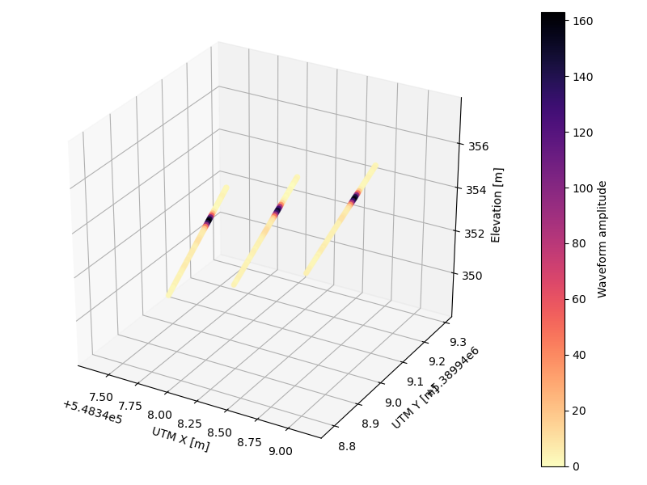

# laspy-waveform

Laspy based lidar waveform reader.

## Install

    git clone https://github.com/Rheinwalt/laspy-waveform.git
    cp laspy-waveform/WaveForm.py ~/your/python/path

## Usage

```python
from mpl_toolkits.mplot3d import Axes3D
import matplotlib.pyplot as pl

import WaveForm as wf

# example files
pfix = '100429_152240_2535pt_UTM'
fn_las = pfix + '.las'
fn_wdp = pfix + '.wdp'

# read entire files
idx, pts = wf.read(fn_las, fn_wdp)

# export to RGB colored LAS file
wf.exportlas('fwf-' + fn_las, pts[:,3], pts)
```


```python
# make a 3d plot with waveforms 5, 6 and 7
pts = pts[idx[5]:idx[8], :]
x, y, z, a = pts[:,0], pts[:,1], pts[:,2], pts[:,3]

# figure
fg = pl.figure(1, (8, 6))
ax = fg.add_subplot(111, projection = '3d')
im = ax.scatter(x, y, z, c = a, cmap = pl.cm.magma_r)
cb = fg.colorbar(im, ax = ax)
cb.set_label('Waveform amplitude')
ax.set_xlabel('UTM X [m]')
ax.set_ylabel('UTM Y [m]')
ax.set_zlabel('Elevation [m]')
pl.tight_layout()
pl.show()
```



